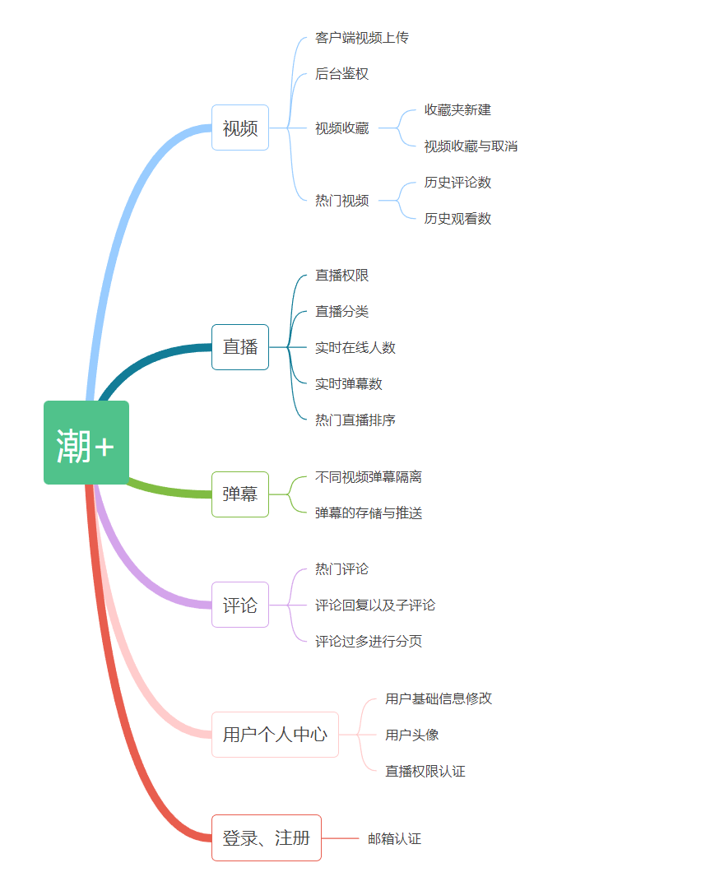
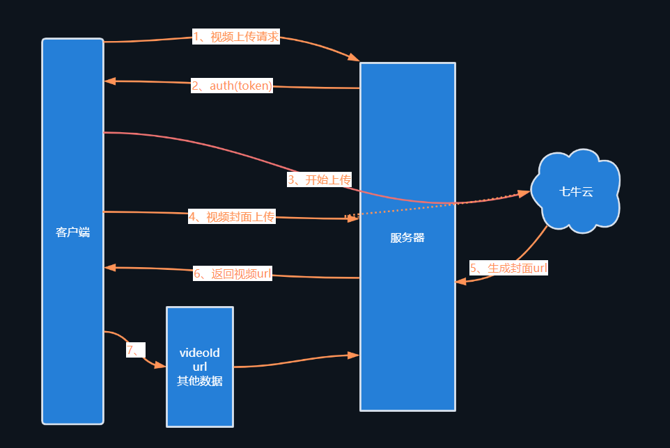
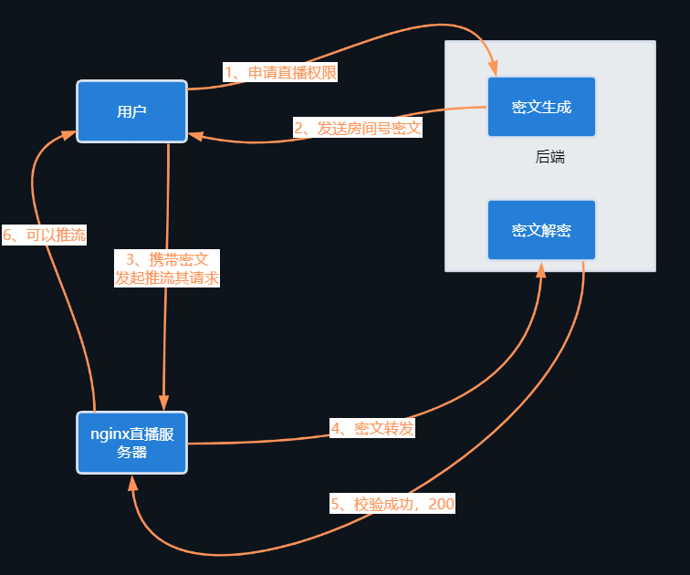
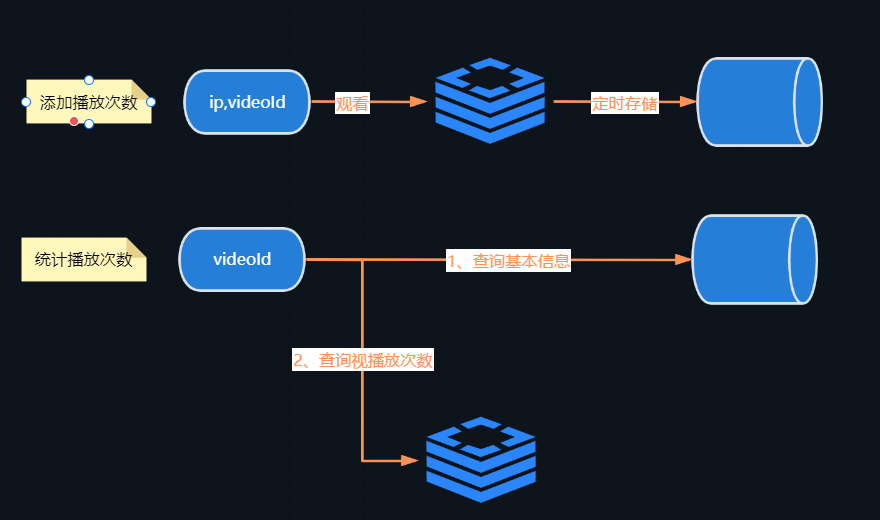
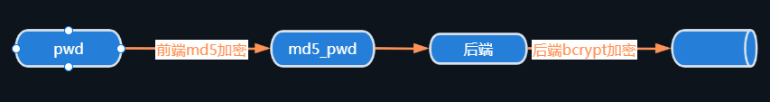
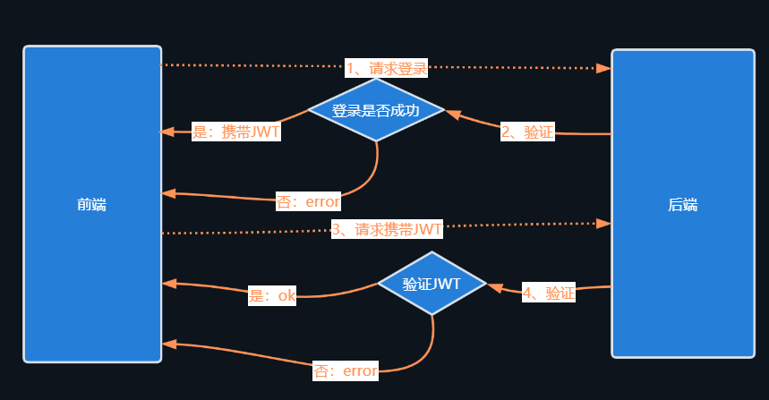
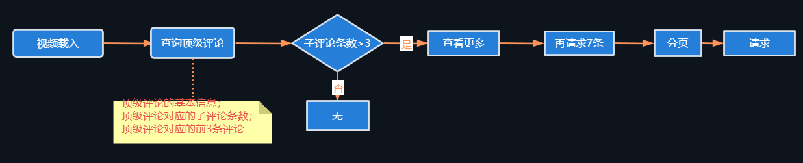
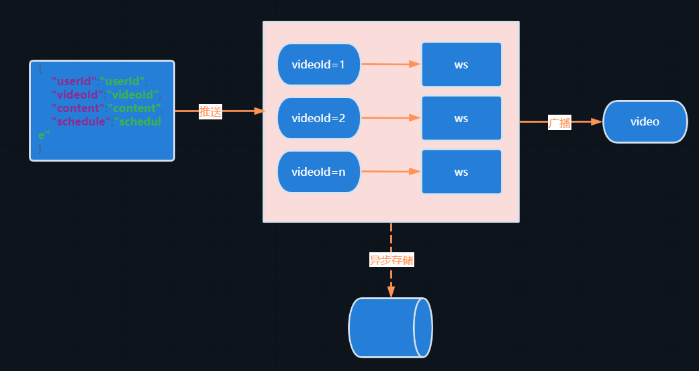

# 设计
我们是一个多元化的在线平台，为那些热爱潮流、音乐和游戏的用户提供了无尽的乐趣和体验。无论您是寻找新灵感、探索音乐世界，还是与其他游戏迷互动，我们都为您提供了一个充满活力和创造力的社区。加入我们，探索您热爱的领域，分享您的激情，一同塑造潮流、音乐和游戏的未来！
直播、点播弹幕系统，前端采用vue3,后端基于springboot
> 项目演示：
https://www.bilibili.com/video/BV1ww411x7Ka/?vd_source=ce062ba3efe2ccb8afe12b0078017476

> 前端地址：https://github.com/HuangJianSheng0822/qiniudemo-ui
## 功能模块架构

# 核心流程图
## 视频信息上传

## 直播鉴权

## 热门视频

## 密码相关

## jwt

## 评论信息

## 弹幕

# 运行注意事项
- mysql8.0及以上,默认3306端口
- redis默认6379端口

